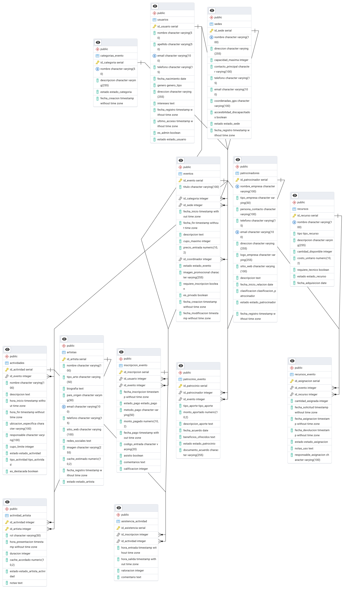

# 📊 Proyecto 3 - Sistema de Reportes para Gestión de Eventos Culturales

Este proyecto es una aplicación web para generar reportes visuales a partir de una base de datos de eventos culturales y asistencia. La aplicación permite consultar diferentes reportes, aplicar filtros dinámicos y exportar los resultados en formatos PDF o Excel.

## 🧱 Tecnologías utilizadas

- [Next.js](https://nextjs.org/) para el frontend
- [PostgreSQL](https://www.postgresql.org/) como sistema gestor de base de datos
- [Docker](https://www.docker.com/) y [Docker Compose](https://docs.docker.com/compose/) para la configuración del entorno

## 🚀 Instalación y puesta en marcha

1. Asegúrate de tener instalados [Docker](https://docs.docker.com/get-docker/) y [Docker Compose](https://docs.docker.com/compose/install/).
2. Clona este repositorio:
   ```bash
   git clone https://github.com/Ultimate-Truth-Seeker/Proyecto3BD.git
   cd Proyecto3BD
   ```
3. Levanta la aplicación con Docker:
    ```bash
    docker compose up
    ```
4. Accede a la aplicación en tu navegador en: http://localhost:3000

## 🖥️ Uso de la aplicación
•	Al iniciar, encontrarás una barra de navegación donde podrás seleccionar el tipo de reporte que deseas generar.

•	Cada reporte cuenta con filtros con valores predefinidos que ya devuelven resultados con los datos de ejemplo incluidos.

•	Puedes ajustar los filtros (como fechas, tipo de actividad, sede, etc.) para afinar tu consulta.

•	Al presionar “Generar reporte”, se mostrará una gráfica interactiva con los resultados.

•	Dispones de botones para exportar el reporte en formato .pdf o .xlsx una vez se haya generado el reporte y haya al menos un dato.

## 🧩 Diagrama Entidad-Relación

A continuación se muestra el diagrama ER que representa el modelo de datos relacional utilizado:
📷 ****

## 📁 Estructura del proyecto
```
Proyecto3BD/
├── db/                     # Scripts SQL, configuración de PostgreSQL
├── proyecto3/              # Proyecto Next.js con la interfaz web
├── docs/
│   ├── ReflexionIndividual.pdf
│   └── P3BD.png            # Diagrama ER de la base de datos
├── docker-compose.yml
└──  README.md
```

## 📄 Licencia

Este proyecto ha sido desarrollado como parte del curso de Bases de Datos y se distribuye solo con fines educativos.
